# Particle I2C Tutorial

I2C, also written as I<sup>2</sup>C, and pronounced I-squared-C, is a method for communicating between devices such as sensors, displays and other peripherals and a microcontroller like the Photon or Electron. It's short for Inter-Integrated Circuit.

The first section has some technical information about how it works and why you might want to use it. 

The second section has some examples of I2C devices that work with the Photon and Electron and some sample code. There are many more devices available. 

## The Basics

### It's a bus!

I2C is a bus. That means there can be multiple I2C devices connected to a single port on the Photon/Electron. There are some limitations to this, which we'll go into details later.

This is different than the serial ports, for example, which generally connected only two devices together.

The communication requires two lines, SDA and SCL. Most devices also require power and ground, so generally 4 wires are needed. The regular version of I2C described here is designed for short distances, up to a few meters, preferably less.

In I2C terminology, the Photon/Electron is the I2C Master device, and all of the other devices (sensors, displays, etc.) are I2C Slave devices. 

### It's an addressable bus

Each I2C device on the bus has an address, which uniquely identifies which device the processor wants to communicate with. 

One difficulty is that the address is only 7 bits, so there are 128 addresses. Sometimes there can be conflicts, which limit the ability to share the I2C bus. 

Also, there may be limits the number of identical I2C devices you can have on an I2C bus. For the LIS3DH accelerometer, it's two. For the DS75 temperature sensor, it's eight. This sub-address is typically set using jumpers, solder pads, or switches.

This is different than SPI, which is also a bus, but uses a device select line (called variously SS, CS, EN, etc.) for each device. So if you want to connect four SPI devices to a SPI bus, you need to dedicate four separate GPIO pins for the select lines, one for each of for the SPI devices.

It's also different than the 1-Wire interface used by the DS18B20 temperature sensors. That has an addressable bus as well, but it has a 64-bit address and each sensor device has a unique serial number from the factory, with no hardware configuration needed.

### It's bidirectional

The SDA (data) line is used to send data both to and from the I2C devices. The I2C protocol determines which direction data will be sent. 

The SCL (clock) line is mostly generated by the processor (Photon/Electron), though it too is somewhat bidirectional when clock stretching is used. That's a detail you won't generally have to worry about; that's taken care of by the Photon/Electron I2C hardware and your I2C device automatically.

But this means you can't use a plain level-shifter, for example, on an I2C bus. The bus switches direction all the time. Fortunately, you rarely need one, as describe below.

### It's open-collector

The bidirectional bus is implemented using open-collector drivers. This is how the transistors are wired, and the details aren't important, however the important thing is this:

Both the processor and the I2C devices only ever pull the bus low. It's either floating, or it's pulled low.

### It requires pull-up resistors

Since floating is bad, the I2C bus must have pull-up resistors. One on the SDA line and one on the SCL line. They're typically 4.7K or 10K ohm.

Many of the breakout boards you can buy at Adafruit or Sparkfun already have the pull-up resistors on them. Here's the schematic for the [Adafruit MCP9808](https://learn.adafruit.com/adafruit-mcp9808-precision-i2c-temperature-sensor-guide/) and you can see the resistors (R1 and R2, 10K ohms) pulling up to VDD.

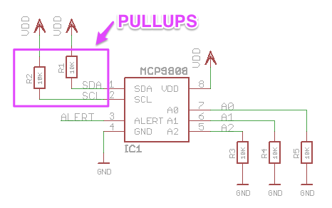

That board also has pull-downs on A0, A1, A2 so the default sub-address is 0. You can tell because the resistors go to GND instead.

If you buy a bare chip that's a sensor, it typically won't have a built-in pull-up resistors so you'll need to add the external resistors.

The pull-ups will often connect to 3V3, but sometimes it will be connected to a 5V supply, as described in the next section.

### It can be 5-volt compatible

The use of open-collector drivers and external pull-up resistors has one big benefit: The Photon/Electron are completely compatible with 5V I2C devices. 

If you have 5V I2C devices you can connect the external pull-up resistors to 5V instead of 3V3. Make sure you connect all of them that way and none are still connected to 3V3. And that all of your I2C devices are 5V compatible.

This allows I2C devices to not only run at 5V, but will also have 5V levels for logic 1 on SDA and SCL. 

This is different than SPI, which is 5V tolerant, but will only supply 3.3V on MOSI and SCK. Most 5V SPI devices will tolerate the lower 3.3V logic level, but with I2C there will be true 5V logic levels.

### Pins

On the Photon, Electron, P1 and Core, the I2C interface (Wire) is on D0 and D1:

- DO: SDA
- D1: SCL

On the Electron, there is a second I2C interface (Wire1) on C4 and C5 as well:

- C4: SDA
- C5: SCL

## About the examples

In all of the examples here I've used the following colors for consistency:

- 3V3: Red 
- VIN: Orange
- GND: Black
- SDA: Green
- SCL: Blue

All of the code is in this Github repository. I recommend downloading the whole thing, either by clone or download zip. Then you can easily use the code examples.

### Using the Particle CLI

Using the [Particle CLI](https://docs.particle.io/guide/tools-and-features/cli/) is an easy to run run these examples.

For example, if you wanted to flash the clock-display example to the device you named "test2" then you'd use the commands:

```
cd clock-display
particle flash test2 .
```

That will automatically include the necessary libraries for you.

For an Electron, you'll probably want to do:

```
cd clock-display
particle compile electron . --saveTo firmware.bin
particle flash --usb firmware.bin
```


### Using Particle Dev (Atom IDE)

It's also easy to open examples using Particle Dev (Atom IDE). 

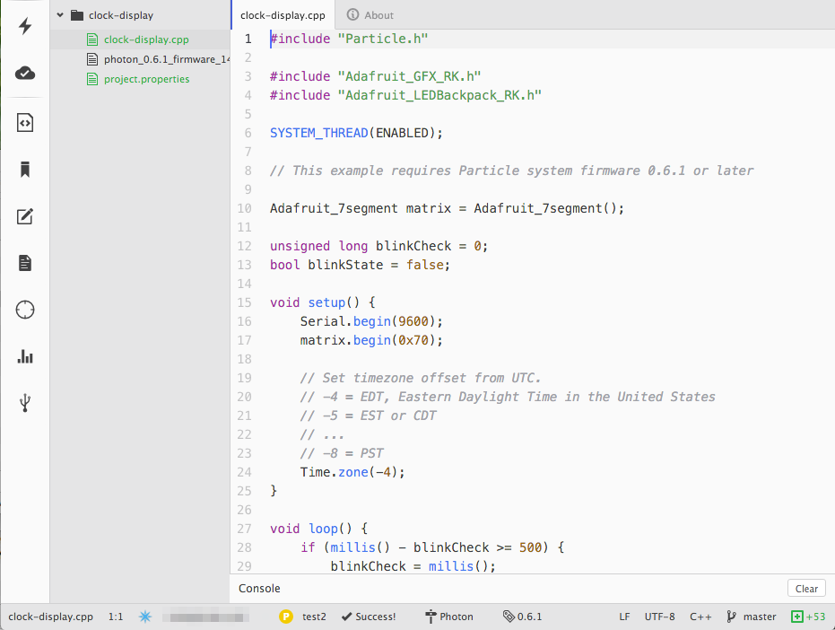

Makes sure you have a recent version of Particle Dev, as older versions don't know how to automatically load libraries. 

Also, you want to make sure you close all open windows, then open the .cpp file for the example you want to use. For example, the clock-display.cpp file. You want to make sure that only a single project is visible in the left-hand folder navigation.

### Using Particle Build (Web IDE)

If you want to use the examples in Particle Build (Web IDE), you need to copy and paste the example source into a new project and then add each of the libraries that it needs.

For example, the clock project has this project.properties.

```
name=clock-display
dependencies.Adafruit_LEDBackpack_RK=1.1.6
```

You would have to add the library Adafruit\_LEDBackpack\_RK to your project in order to run the sample code.


## Displays

One common use for I2C is displays. Here are just a few possibilities:

### 7-segment

Adafruit has this [0.56" high 4-digit 7-segment LED display](https://www.adafruit.com/products/879). Basically, a digital clock display.

To wire it up, connect:

- VCC to VIN (orange)
- GND to GND (black)
- SDA to D0 (green)
- SCL to D1 (blue)

This display is designed to run a 5V, so we power it from VIN on the Photon, which is approximately 4.8V and connected to the USB power input. 

Since the display is like a clock, here's sample code that makes a digital clock.

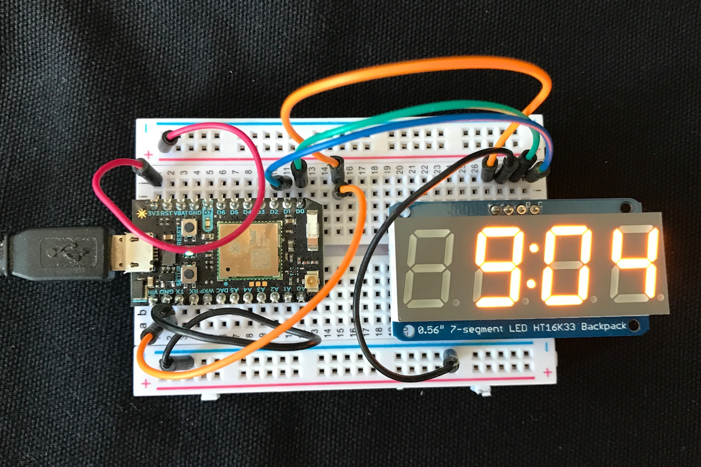

The sample code is in the clock-display folder. 

### Mini 8x8 LED matrix

Adafruit has this little (0.8") LED matrix, available in red, green, blue, yellow and white. This example uses the [yellow one](https://www.adafruit.com/products/871).

To wire it up, connect:

- VCC to VIN (orange)
- GND to GND (black)
- SDA to D0 (green)
- SCL to D1 (blue)

This display is designed to run a 5V, so we power it from VIN on the Photon, which is approximately 4.8V and connected to the USB power input. 

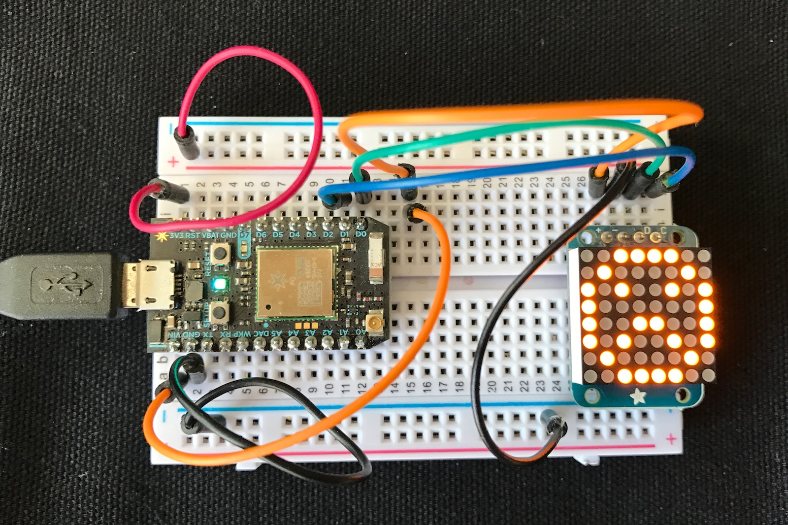

For this example we'll combine it with an Adafruit [10-DOF IMU](https://www.adafruit.com/products/1604) (accelerometer plus other sensors). Actually, it works with the [9-DOF](https://www.adafruit.com/products/1714), and actually anything that includes the [LSM303 compass](https://www.adafruit.com/products/1120) as we only use the LSM303 in this example.

For the compass sensor, we also connect:

- VCC to VIN (orange)
- GND to GND (black)
- SDA to D0 (green)
- SCL to D1 (blue)

Here we've connected two I2C devices to the same I2C bus and they work fine together.

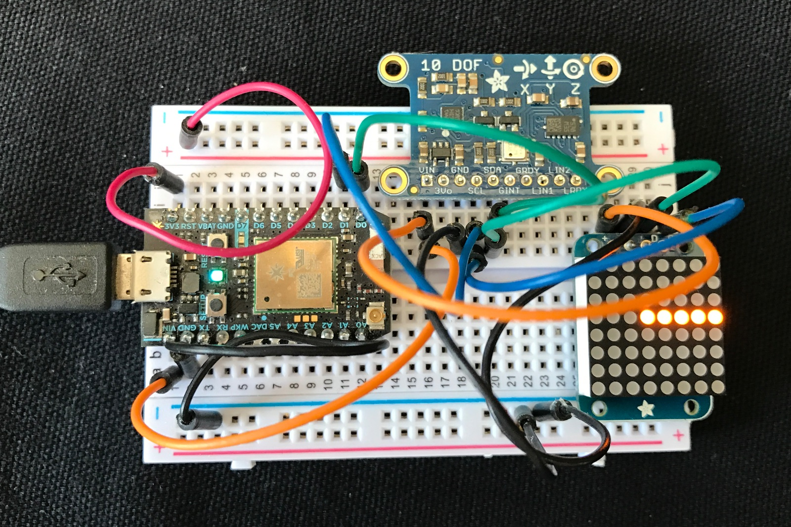

The sample code is in the compass folder. 

### OLED

0.96" OLED I2C displays are inexpensive and easy to use. This one is compatible with the SSD1306 and is 128x64 pixels. 

The sample code in the bme280-oled project combines a BME280 temperature and humidity sensor and a SSD1306 OLED display to display the current temperature and humidity. Since both devices use I2C is only uses two pins on the Photon, D0 and D1.

The connections to the BME280 are described below. The SSD1306 connects as follows:

- VCC to 3V3 red
- GND to GND black
- SCL to D1 (SCL) blue
- SDA to D0 (SDA) green


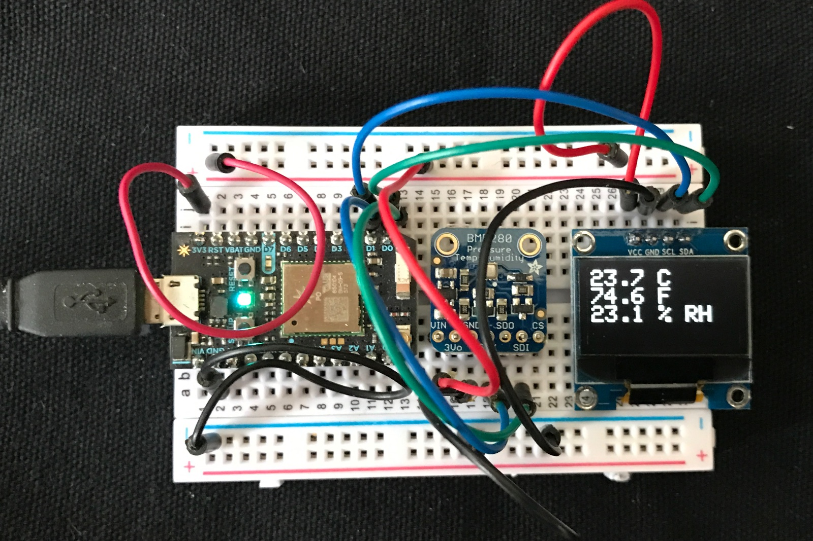

The sample code is in the bme280-oled folder.


## Temperature Sensors

There are a number of temperature sensors that work on the Photon. The TMP36 is an analog sensor, connecting to an ADC input on the Photon. 

The DS18B20 is a 1-wire temperature sensor, which uses a different protocol than I2C, and uses fewer wires than I2C.

The DHT22 uses a proprietary digital protocol and measures temperature and humidity.

But in this tutorial we'll concentrate on the I2C temperature sensors including the BME280 (and its cousin the BMP280) and also the DS75.

### BME280 to Google Spreadsheet

The BME280 is a high-accuracy temperature, humidity and pressure sensor that connects by I2C or SPI. It was ranked best in a [sensor shootout](http://hackaday.com/2017/01/03/humidity-sensor-shootout/) but it is more expensive. I got mine from [Adafruit](https://www.adafruit.com/products/2652).

- VIN to 3V3 (red) or VIN 
- 3VO no connection
- GND to GND (black)
- SCK to D1 (SCL) blue
- SDO no connection
- SDI to D0 (SDA) green
- CS no connection

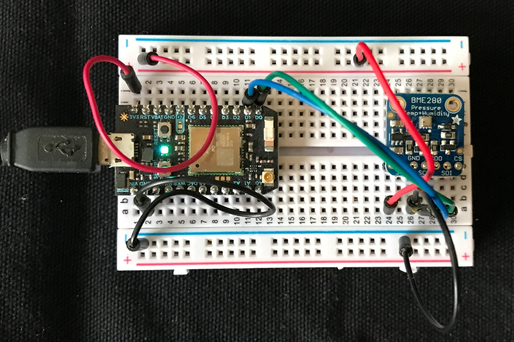

You can also power the sensor from VIN instead of 3V3. The Adafruit board has built-in pull-up resistors so you don't need them on SDA and SCL.

This example takes the temperature (in &deg;C), pressure (in hPa), and relative humidity (%) and stores it in a Google spreadsheet.

The firmware is easy:

```
#include "Adafruit_BME280_RK.h"

Adafruit_BME280 bme; // I2C

const unsigned long PUBLISH_PERIOD_MS = 60000;
const char *FIELD_SEPARATOR = "|||";
const char *EVENT_NAME = "tempSensor";

bool sensorReady = false;
unsigned long lastPublish = 0;
char buf[256];

void setup() {
    Serial.begin(9600);

    sensorReady = bme.begin();
}


void loop() { 
	if (millis() - lastPublish >= PUBLISH_PERIOD_MS && sensorReady) {
		lastPublish = millis();
		
		float temp = bme.readTemperature(); // degrees C
		float pressure = bme.readPressure() / 100.0; // hPa
		float humidity = bme.readHumidity(); // % 
		
		snprintf(buf, sizeof(buf), "%.02f%s%.02f%s%.01f", temp, FIELD_SEPARATOR, pressure, FIELD_SEPARATOR, humidity);
		Particle.publish(EVENT_NAME, buf, PRIVATE);
	}
}
```

The full source code is in the bme280-google-sheets folder.

The magic of getting it into a Google Sheet is to use [IFTTT](https://ifttt.com). Just create account and a new Applet.

- Create a new Applet. Click on **+ this**.
- Step 1: Choose a service: Select **Particle**.
- Step 2: Choose a trigger: Select **New event published**.
- Complete trigger fields:

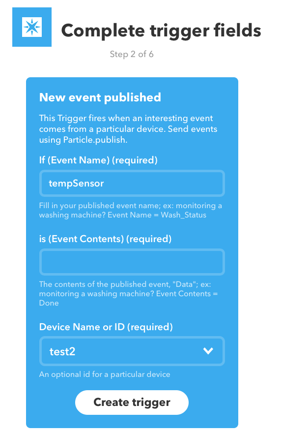

- Click on **+ that**.
- Step 3: Choose an action service: **Google Drive**.
- Step 4: Choose action: **Add row to spreadsheet**.
- Step 5: Complete action fields:

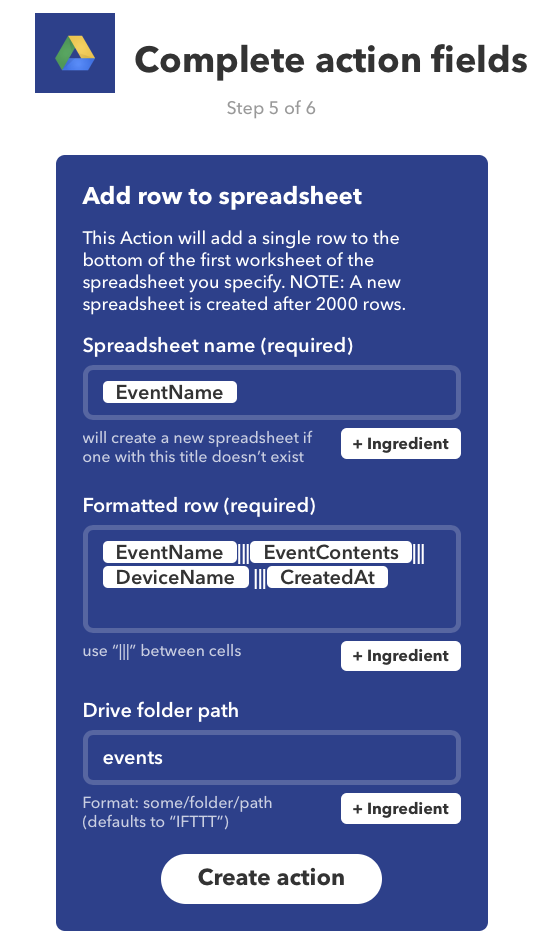

And, shortly thereafter, rows will start appearing in your Google Spreadsheet. It even automatically updates the web page view as new rows are added. 


### BME280 to Ubidots

[Ubidots](https://ubidots.com) is a 3rd-party service that makes creating dashboards, graphs, tables, etc. really easy.

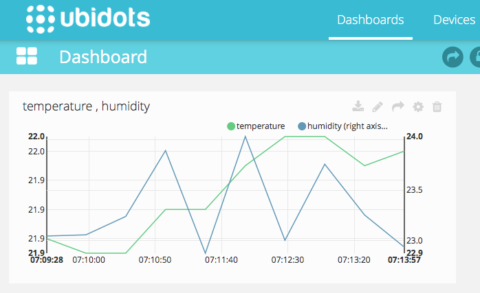

The sample code is in the bme280-ubidots folder.


### DS75

The DS75 isn't meant to be a super-accurate room temperature sensor like the BME280. It's accurate to &plusmn;2&deg;C, though it has a resolution of up to 0.0652&deg;C. It's ideal for measuring the temperature of circuit boards or the temperature inside an enclosure.

It's inexpensive (US$1.90 in single quantities) and tiny (SOIC-8 package), and you can connect 8 of them to a single I2C bus. 

I purchased mine at [Digi-Key](https://www.digikey.com/product-detail/en/maxim-integrated/DS7505S-/DS7505S--ND/2045448) along with the [SparkFun SOIC-8 to DIP Adapter](https://www.digikey.com/product-detail/en/sparkfun-electronics/BOB-13655/1568-1123-ND/5528943). It takes some careful soldering to solder a SOIC-8 by hand, but it's not bad if you have a good soldering iron after you've done it a few times.

The driver, code examples, and wiring instructions are in the [DS75-RK Github repository](https://github.com/rickkas7/DS75-RK). The library is in the community libraries as DS75-RK.

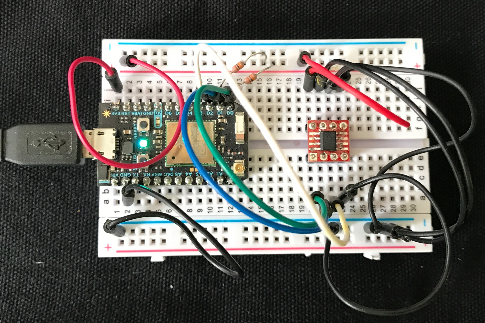

## GPIO Expanders

The Photon includes a large number of digital input and output, or general purpose I/O, GPIO, pins. With some limitations there are 18 on the Photon, even more on the Electron. But sometimes you need more, and an I2C GPIO expanded can be helpful. The MCP23008 is an 8-port GPIO expander.

I have [created a library](https://github.com/rickkas7/MCP23008-RK) for the MCP23008 on the Photon in a way familiar to Particle programmers. You can find the documentation at the link, and its available in the community libraries as MCP23008-RK.

For example:

```
#include "MCP23008-RK.h"

MCP23008 gpio(Wire, 0);

void setup() {
	Serial.begin(9600);

	gpio.begin();
	gpio.pinMode(0, OUTPUT);
	gpio.digitalWrite(0, HIGH);
}

void loop() {
}
```


You can connect up to 8x MCP23008 chips to a single I2C bus on the Photon, just in case you need 64 GPIOs!

As it's a bare chip, don't forget to add 4.7K or 10K pull-up resistors on SDA and SCL.

Another nice thing is that you can power the MCP23008 from a 5V supply and it will provide true 5V output GPIO. This is handy if you are interfacing to something that needs true 5V for logic level high. 


## ADC (Analog to Digital Converters)

The Photon includes 8 ADC inputs for converting an analog to a digital value, 0-4095 in the case of the 12-bit ADCs in the Photon.

Sometimes you want more, and in that case an I2C ADC may be what you need.

Another reason is that you want to measure a voltage from a very high impedance source. The built-in ADC on the STM32F205 has trouble measuring these sources. Using an [ADC with a built-in programmable amplifier](https://www.adafruit.com/product/1083) can make it easier to measure some voltage sources. 


## PWM

PWM (pulse-width modulation) outputs are commonly used to drive LEDs as they can adjust the brightness. They're also used for servos to control the position of the servo. While the Photon includes 7 independent PWM outputs, sometimes you need more.

The [Adafruit 16-channel 12-bit PCA9685 PWM/servo driver](https://www.adafruit.com/product/815) is one way to solve this problem. And since it has 6-bits of I2C addressing, you can even add 62 of these boards, just in case you need 992 PWM outputs (theoretically, at least) on a single I2C port.


## FRAM Memory

One interesting thing you can add by I2C is FRAM, or Ferroelectric RAM. This particular device is 32K bytes. The main advantage is that it's non-volatile like EEPROM, so the contents don't go away when you remove power. But it's much faster and doesn't wear out like EEPROM, so it's great if you need to save data frequently.

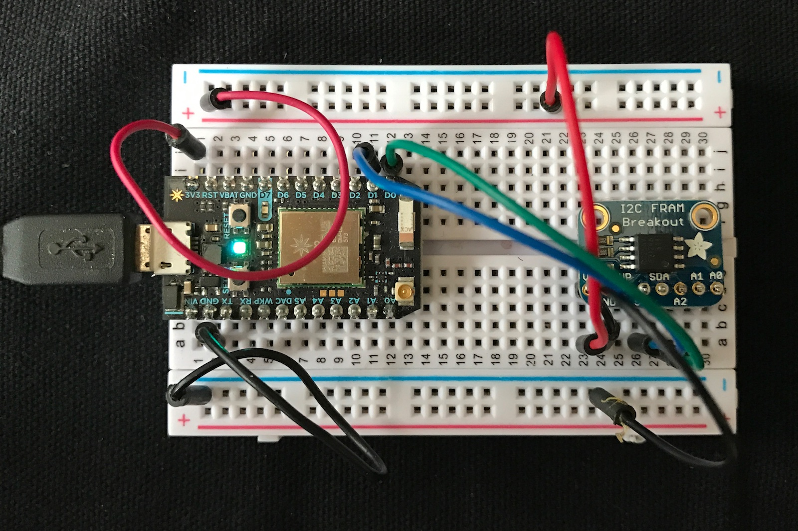

The example code and library are here: [https://github.com/rickkas7/MB85RC256V-FRAM-RK](https://github.com/rickkas7/MB85RC256V-FRAM-RK).


## Multiplexer: TCA9548A

Once you have all of these I2C devices, what happens if you have address conflicts, or need to run busses at different voltages? One easy solution is to add a TCA9548A.

I purchased mine from [Adafruit](https://www.adafruit.com/products/2717) which has the surface mount chip soldered on a handy breakout board.

This example, mux-led, uses a TCA9548A to run two separate LED displays, both on address 0x70. There are solder pads on the underside of the LED display controllers that allow you to change the address, but I needed something to demonstrate the TCA9548A.

It's just a matter of setting the channel to select which I2C bus you want to control before you use it. That's it!

```
mux.begin();

mux.setChannel(0);
sevenSeg.begin(0x70);
	
mux.setChannel(1);
alphaNum.begin(0x70);
```

The example code and library are here: [https://github.com/rickkas7/TCA9548A-RK](https://github.com/rickkas7/TCA9548A-RK).

This is an example of using the TCA9548A to drive two LED displays that use the same I2C address.

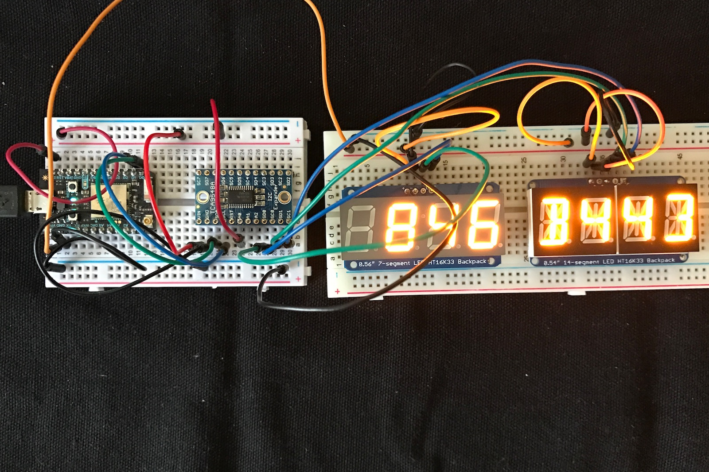

The code is in the mux-led folder.


## Using the Wire1 port on the Electron

The Electron has two I2C ports, Wire and Wire1. The Wire1 port is on C4 and C5:

- C4: Wire1 SDA
- C5: Wire1 SCL

It works the same as the regular port on the Photon, though not all libraries work with it. Most of the Adafruit libraries, for example, assume only 1 I2C port and use that. 

Note that the VIN pin on the Electron only supplies 4.8V when powered by USB. When using a battery, the VIN pin is not powered. This will be an issue if you want to power 5V I2C sensors. The usual method is to use an external step-up DC-DC converter. This will boost 3.3V (3V3) to 5V.

In this circuit, I made the following connections:

- 1 SDA to C4 (green)
- 2 SCL to C5 (blue)
- 3 OS to D2 (white)
- 4 GND to GND (black)
- 5 A2 to GND (black)
- 6 A1 to GND (black)
- 7 A0 to GND (black)
- 8 VDD to 3V3 (red)

Since this is a bare chip, not a breakout board, I also added 10K pull-up resistors to C4 and C5.

To build and flash over USB, I use the following commands:

```
cd ds75-electron-wire1
particle compile electron . --saveTo firmware.bin
particle flash --usb firmware.bin
```

And here's the output from serial:

```
temp 22.500000C 72.500000F
temp 22.500000C 72.500000F
temp 22.500000C 72.500000F
```

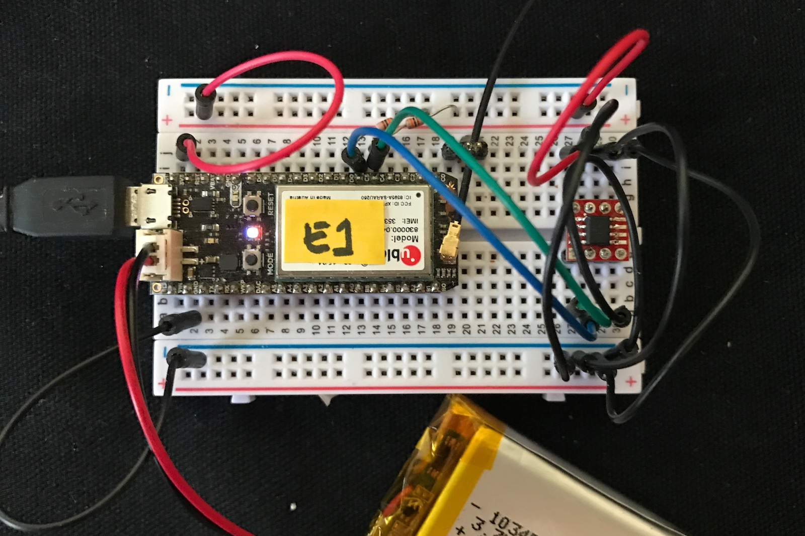

## Control Everything

[Control Everything](https://shop.controleverything.com) makes a large number of sensors boards for the Photon and Electron. For I2C sensors, one of the nice things is that the boards connect with 4-conductor locking ribbon cables, so you can use them as-is in permanent installation.

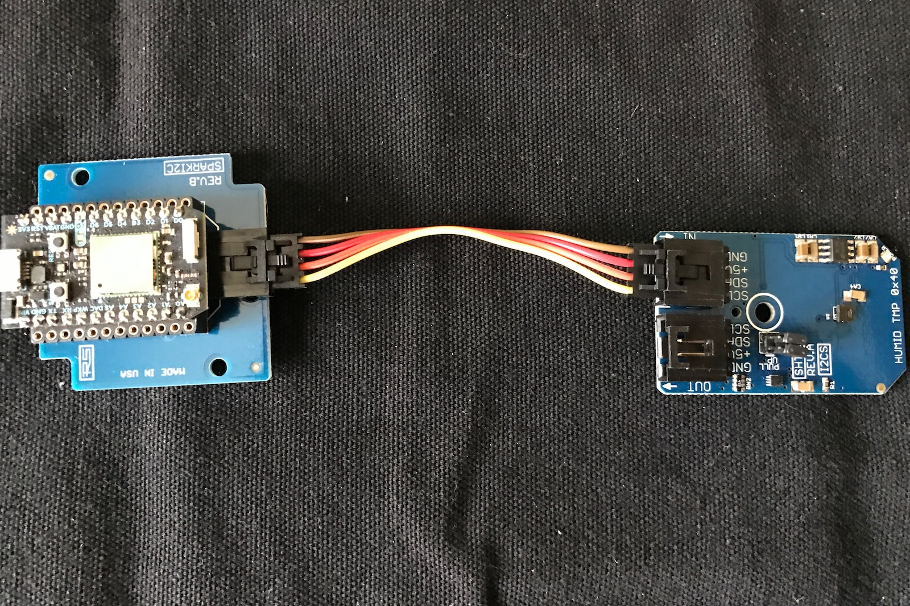

The boards can be chained together, and there are also boards that hold the Electron and Photon that have screw terminals, in case you need something like that, as well.


## I2C Scanner

If you're having trouble interacting with an I2C device the I2C scanner firmware may be helpful. It's in the i2c-scanner directory. If you wanted to flash it to the device "test2" you'd use these commands:

```
cd i2c-scanner
particle flash test2 .
```

And the output would be this if you had a BME280 connected to the I2C bus:

```
I2C Scanner
Scanning...
I2C device found at address 0x77  !
done
```

The source code is in the ic2-scanner folder.

## Using Saleae Logic Analyzer

If you're really getting into working and debugging I2C, a great thing to have is a [Saleae Logic](https://www.saleae.com), a USB-based logic analyzer.

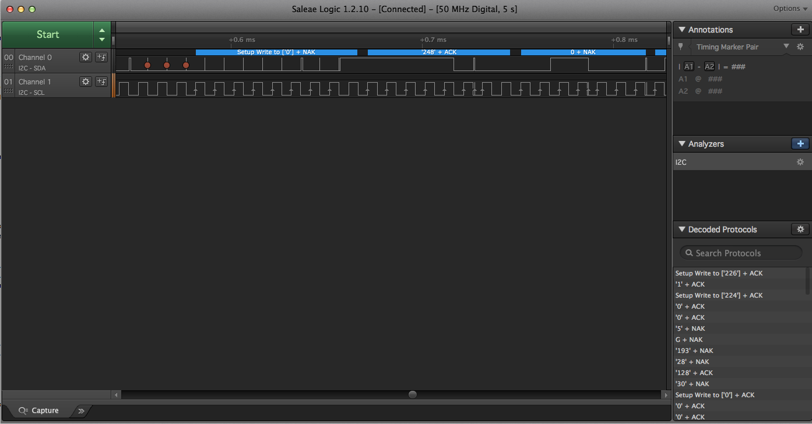

Not only can it display the waveforms, but it can also decode I2C, making it much easier to debug problems.

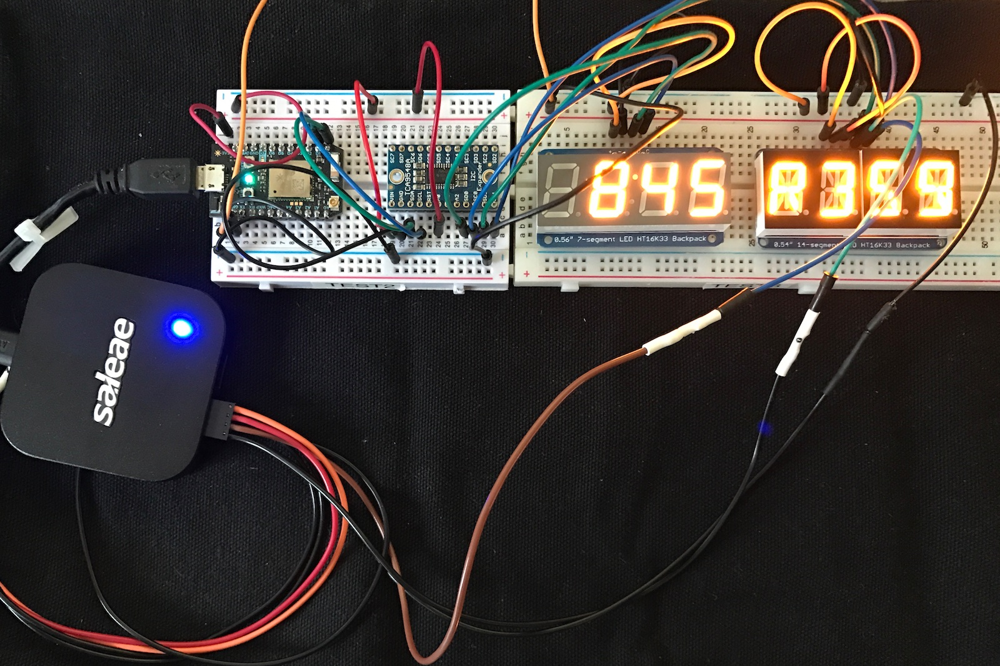


## I2C Slave Mode

In all of the examples above, the Photon/Electron was the I2C Master Device. It's also possible to use it as a slave device. You might do this if you're connecting two Particle devices together using I2C, or maybe if you were connecting a Photon or Electron to a Raspberry Pi.

The I2CSlaveRK library makes it easy to turn a Photon into something that behaves like many I2C slave devices. You configure how many "registers" it has, and either side can set or get the 32-bit values in these registers.

The values are kept in the I2C slave Photon/Electron, and the master device queries these values in same way most I2C devices work. It can either get or set the registers.

Additionally, the slave can find out if the master has set any registers recently. This can be used to have the master trigger an action in the slave by writing to a register.


The example code and library are here [https://github.com/rickkas7/I2CSlaveRK](https://github.com/rickkas7/I2CSlaveRK).


